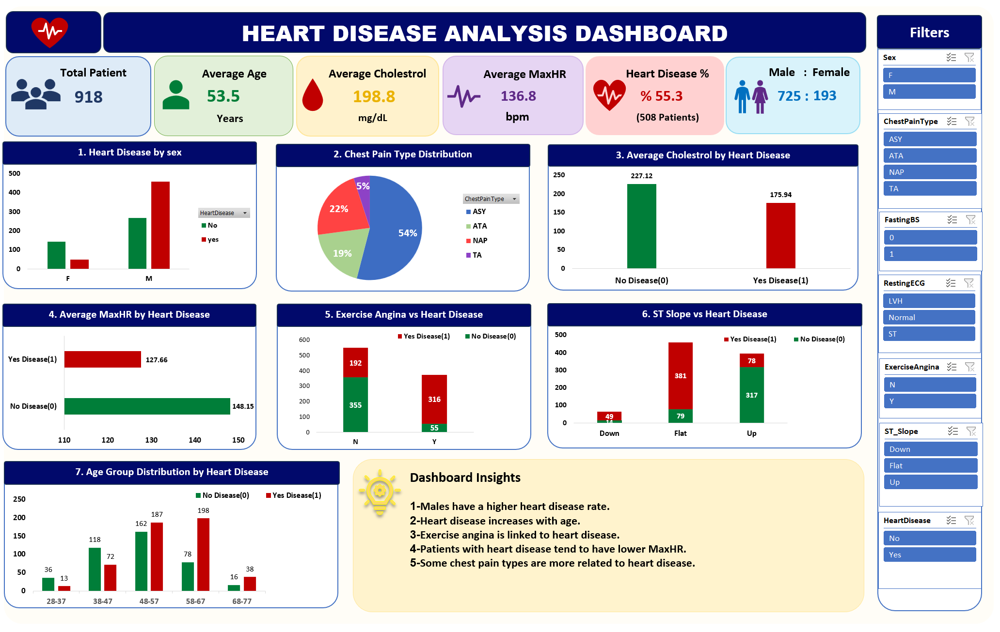

# 📊 Heart Disease Dashboard - Excel

## 📌 Project Overview
This project presents an interactive Heart Disease Dashboard built using Microsoft Excel. The dashboard helps analyze patient data and identify key insights through interactive visualizations.

## 🛠️ Tools Used
- Microsoft Excel
- Pivot Tables
- Pivot Charts
- Slicers
- Conditional Formatting

## 📈 Dashboard Features
- Total Patients
- Heart Disease Distribution
- Average Age
- Average Cholesterol
- Maximum Heart Rate
- Chest Pain Analysis
- Interactive Filters

## 🔍 Key Insights
- Males have a higher heart disease rate.
- Heart disease increases with age.
- Exercise angina is linked to heart disease.
- Patients with heart disease tend to have lower MaxHR.

## 📂 Dataset
Heart Disease Dataset

## 👨‍💻 Author
**Abdelaziz Elshourbgy**
